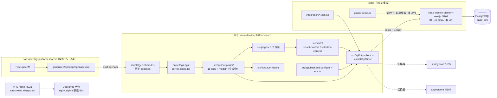
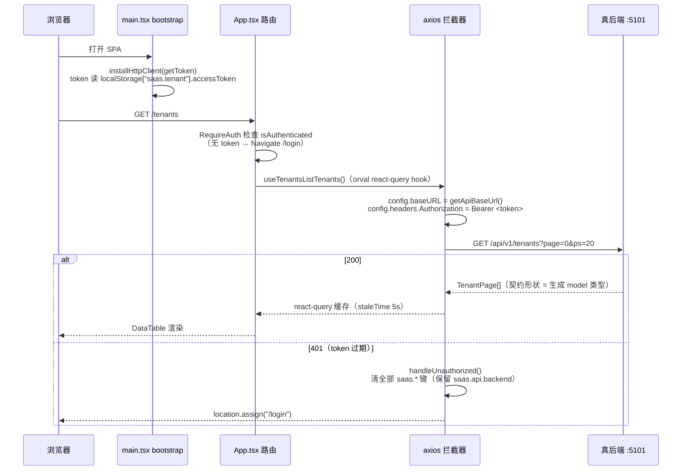

# saas-identity-platform-react 架构

> 一句话定位：saas-identity-platform 多仓家族中的 **React 前端仓**——同一份 shared 契约的 React 19 + Vite SPA 实现，API 客户端由 shared 契约经 orval 两步 codegen 生成，消费家族内任一真后端（默认 nextjs :5101），由 suite harness 做 L1-L4 门禁。

生成日期：2026-09-22 ｜ 锚定 HEAD：6898c3f ｜ 生成方式：DeepWiki 风格架构扫描

## 1. 总览

- **定位与职责**：家族 6 角色中的「前端」角色。SaaS 多租户多应用身份平台的管理控制台 SPA：租户/成员/角色/菜单/应用(OAuth client)/租户应用订阅管理 + OAuth 授权码登录跳板。与 vue/nextjs 前端是「同契约、异实现」的平行兄弟仓。
- **技术栈**（版本钉死于 `version-lock.json`）：
  - React 19 + react-router-dom 7 + @tanstack/react-query 5
  - Vite 6 + TypeScript 5.7 + Tailwind v4 + shadcn/ui（Radix primitives）
  - axios 1.7 + orval 7.5（react-query client 模式）
  - vitest 2 + @testing-library/react（jsdom）
- **规模速览**（实测）：
  - `src/` 128 个文件，TS/TSX 约 11,292 行（其中 orval 生成物占大头）
  - 8 个页面组件、12 条路由、21 个 UI 基件 + 12 个业务组件
  - `src/api/endpoints/` 按契约 @tag 拆 11 个 tag 目录 + `model/`，导出约 95 个请求函数 / react-query hooks
  - `tests/` 19 个文件、约 2,261 行，14 个集成测试套件

## 2. 系统架构

关键边界解读：

1. **契约边界是单向的**：shared 仓只产 `openapi.yaml`；本仓通过 `scripts/gen-shared.ts` 两步流水线（shared `emit:openapi` → 本地 orval）消费生成物，**禁止**直接 import shared 的 TS 代码（CLAUDE.md §2 铁律）。
2. **HTTP 边界收口在一个文件**：所有请求都经 `src/api/http-client.ts` 的 axios 拦截器注入 baseURL 与 Bearer token；组件内直接 `fetch` 是被禁的（唯一豁免是 `apiRequest` 兼容包装）。
3. **后端可切但不常态**：`backend-config.ts` 提供运行时切换器（localStorage `saas.api.backend` 持久化，dev 走 localhost 端口表，prod 走各仓 deploy nginx 域名）；默认值来自 env 单 URL。
4. **测试打真服务**：`tests/global-setup.ts` 起真 saas-nextjs :5101 并铸真 JWT，绝不降级 mock——这是与「msw fixtures 直连」旧描述的现行差异（见 §5 演化注记）。

## 3. 模块分解

| 模块/目录 | 职责 | 关键文件 |
|---|---|---|
| `src/api/endpoints/` | **orval 生成物（整目录 orval-owned）**：11 个 tag 文件（auth/oauth/me/tenants/admin-tenants/admin-clients/clients/client-menus/tenant-members/tenant-roles/tenant-role-menus/tenant-applications）+ `model/` schemas | `endpoints/auth/auth.ts`、`endpoints/model/index.ts` |
| `src/api/endpoints.schemas.ts` | 手写 barrel：纯 re-export 生成类型，零手写 interface（Phase C4 手写 override 全删） | `endpoints.schemas.ts` |
| `src/api/http-client.ts` | axios 拦截器装配：注入 baseURL + Bearer；`ApiError` 封装；401 清 `saas.*` localStorage 并踢回 `/login`（豁免 auth/oauth 流与登录页） | `installHttpClient()` |
| `src/api/backend-config.ts` + `src/api/env.ts` | 后端寻址：env 单 URL + 运行时切换器（dev 端口表 / prod 域名，`import.meta.env.PROD` 分档）；`src/api/env.ts` 是 `VITE_*` 全仓唯一适配点 | `getApiBaseUrl()`、`BACKENDS` |
| `src/state/tenant-context.tsx` | 会话状态：currentTenantId/accessToken/refreshToken/user，持久化 `localStorage["saas.tenant"]`，lazy initializer 同步 hydrate | `TenantProvider`、`useTenant` |
| `src/state/selection-context.tsx` | 页面级焦点选中（当前租户/应用 id+name），持久化 `saas.selected.tenant` / `saas.selected.app` | `SelectionProvider` |
| `src/lib/oauth-flow.ts` | OAuth 2.0 授权码流（RFC 6749 §4.1）薄包装：state 生成/校验 + token 兑换，叠在 orval `oauth.ts` 之上；对应 M04.F03.I01-I03 | `generateState()`、`consumeState()` |
| `src/pages/` | 8 个页面：Login、TenantList、UserList（成员）、RoleList、RoleMenuGrant、TenantApplications、AppList（OAuth client）、MenuTree | `LoginPage.tsx` 等 |
| `src/App.tsx` + `src/main.tsx` | 路由表 + `RequireAuth` 守卫 + Provider 装配（QueryClient→Tenant→Selection→Router）+ 启动时装 `installHttpClient` | `App.tsx` |
| `src/components/ui/` | shadcn/ui 基件（button/table/dialog/select…） | 21 个 tsx |
| `src/components/app/` | 业务组件：AppShell（sidebar+header）、DataTable、CrudDialog、BackendBadge、PaginationBar、NavItems 等 | `app-shell.tsx`、`data-table.tsx` |
| `scripts/gen-shared.ts` | codegen 编排：shared emit → orval → prettier（byte-idempotent）→ 写 `.state/last-gen-shared.json` marker（ADR-0026，同 sha 零写入） | `gen-shared.ts` |
| `tests/` | 集成测试：`global-setup.ts` 真服务基座（灌种子→起 nextjs→铸 JWT→双探针→库身份探针，全 fail-fast）；`fnReporter.ts` 桥接 trace | `global-setup.ts`、`helpers/real-chain.ts` |

## 4. 数据流 / 请求生命周期

以最有代表性的一条链路为例：**页面加载到数据呈现（租户列表）**。

要点：hook 函数本身由 orval 生成、只写相对路径 `/api/v1/...`；baseURL 与鉴权全部由启动时装一次的拦截器动态解析——这正是「axios 拦截器必须 install、否则 405」事故的修复点（`main.tsx` 注释 v0.3.20）。

## 5. 依赖面

- **对 shared 契约仓**（`../saas-identity-platform-shared`）：
  - 消费物只有 `generated/openapi/openapi.yaml`（运行 `npm run gen:shared` / `prebuild` 自动产出）；
  - orval `tags-split` 模式按 11 个 @tag 拆文件，schemas 集中 `model/`，`clean` 清空再生成保证整目录 orval-owned；
  - 同步水位由 `.state/last-gen-shared.json` marker 记账（ADR-0026）。
- **对家族其他仓**：
  - **saas-identity-platform-nextjs**：单测真链路后端 + 默认 API 目标 + OAuth IdP（`:5101`）；`tests/global-setup.ts` 读取其 `.env.local` 键（仅 process.env 缺失时）。
  - **后端切换器**：aspnetcore `:5104` / springboot `:5105`；prod 域名 `saas-aspnetcore/saas-springboot.xiangru.uk`（`backend-config.ts` BACKENDS 表）。
  - token 互认：JWT 由家族统一签发（`saas.tenant` 里的 accessToken 对各后端通用）。
- **演化注记（仓内文件存在新旧两代描述，以代码现状为准）**：CLAUDE.md 仍写「msw fixtures 直连、零 npm 依赖、默认 springboot :5105」，但 `package.json` 描述、`.env.example`、`backend-config.ts` 均已推进到「2026-09-17 msw 仓删除、默认 nextjs :5101、单测真链路」；`Dockerfile` 中 clone msw 仓的步骤属历史残留。当前生效路径以 `src/api/backend-config.ts` 为准。
- **外部依赖**：PostgreSQL（仅经后端间接依赖；测试链用 `saas_dev` 三库分层约定）；无直接第三方服务。

## 6. 配置与部署

### env 变量表

| key | 用途 | 缺失时的行为 |
|---|---|---|
| `VITE_API_BASE_URL` | 后端单 URL（build 期烘焙） | `env.ts` 回落 `""`，再由 `backend-config.ts` 兜到 `http://localhost:5101` |
| `VITE_API_MODE` | UI 显示标签（不参与路由） | 默认 `"msw"`（`env.ts`）/ `.env.example` 写 `nextjs` |
| `VITE_DEV_PORT` | Vite dev server 端口 | vite.config.ts：非空才采纳，否则固定 `5102`（防静默兜底为空串） |
| `VITE_LOGIN_CLIENT_ID` | 登录页 clientId 兜底（ADR-0030 B 方案），值须 = `oauth_client.client_id` | `.env.example` / Dockerfile 写 `saas-console` |
| `DATABASE_URL` | 仅测试链：global-setup 灌种子目标库 | **fail-fast**——只认 process.env，禁 `.env.local` 回落（防误灌真库） |
| JWT 三键（`JWT_SIGNING_KEY/ISSUER/AUDIENCE`） | 仅测试链铸 token | process.env 优先，回落 nextjs `.env.local`，两头皆无 **fail-fast** |

### 端口与部署

- dev server：**5102**（saas 段 X02，跨仓端口分段约定）；测试后端 nextjs `:5101`。
- 构建产物：`tsc -b && vite build` → `dist/` 静态文件（`VITE_*` build 期烘焙进 bundle）。
- 部署：`Dockerfile` 多阶段——`node:24-alpine` builder（clone shared sibling → npm install → build）+ `nginx:alpine` 运行时（容器 :80，HEALTHCHECK wget）；VPS nginx 反代 host :8021 → `saas-react.xiangru.uk`。npm registry 钉 npmmirror。
- 版本放行：全量回归绿后打 `v<MAJOR>.<MINOR>.<PATCH>-<YYYYMMDD>` tag。

## 7. 质量门禁

来自 `.harness/stack.json`（stack: `react-ts`，suite_version 0.6.0）：

| 门 | 名称 | 命令 | 修法 |
|---|---|---|---|
| L1 | 格式 | `npx --no -- prettier --check src tests` | `npx prettier --write src tests` |
| L2 | 静态检查 | `npx --no eslint src tests` | 逐条修复 eslint |
| L3 | 类型 | `npx --no tsc --noEmit` | 补全类型 |
| L4 | 测试 | `npx --no vitest run` | 先让测试变绿 |

- `trace_cmd`: `npx --no vitest run`，`trace_env` 带 `TRACE_MAP=1`——功能 ID 挂账由测试运行产出，禁止手写 trace。
- 入口：suite 根目录 `python scripts/gate.py -p saas-identity-platform-react`。**exit code 语义**：`0` 完成；`1` 按修复提示回代码；`2` 契约/环境问题，停下问人。
- 环境前提：L4 需 nextjs `:5101` 可用且 `DATABASE_URL` 显式注入（gate 自动注入；缺 env 时 setup fail-fast，属 exit 2 类停下问人）。
